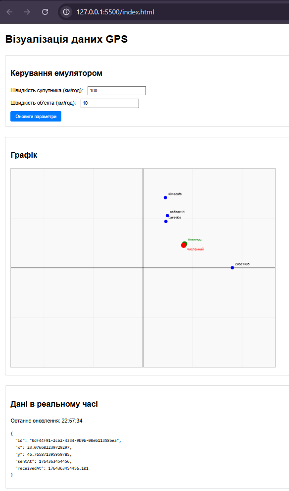

# Лабораторна робота: Візуалізація вимірювань GPS у реальному часі


## Про проєкт
Метою даної лабораторної роботи є розробка веб-додатку для безперервного отримання, математичної обробки та візуалізації даних супутникової навігації (GPS). Додаток інтегрується з локальним емулятором, зчитує координати супутників і паралельно обчислює позицію цільового об'єкта, застосовуючи два принципово різні математичні підходи: **аналітичний** та **чисельний**.

---

## Архітектура та реалізований функціонал

### 1. Інтеграція з емулятором
* Розгорнуто середовище тестування за допомогою Docker-контейнера, що генерує GPS-сигнали.
* Налагоджено стабільне WebSocket-підключення (через порт `4001`) для стрімінгу даних у реальному часі.
* Реалізовано можливість динамічної зміни параметрів емуляції через REST API.

### 2. Клієнтський інтерфейс (Frontend)
* Створено адаптивну HTML-структуру, логічно розділену на три секції: панель підключення, блок керування параметрами та зону візуалізації.
* Для відмальовування радіолокаційної обстановки інтегровано високопродуктивний Canvas API з координатною сіткою.
* Інтерфейс стилізовано за допомогою сучасного CSS для зручного сприйняття інформації.

### 3. Математичне ядро (Алгоритми)
Система обчислює координати об'єкта паралельно двома методами:
*   **Аналітичний метод:** Базується на точному розв'язанні системи геометричних рівнянь.
*   **Чисельний метод:** Використовує бібліотеку `numeric.js` для ітеративної мінімізації функції сумарної похибки.

### 4. Візуалізація даних на Canvas
На екрані в реальному часі відображається:
*   🔵 **Сині маркери** — поточне просторове положення супутників.
*   🟢 **Зелений маркер** — розрахункова позиція об'єкта (за Аналітичним методом).
*   🔴 **Червоний маркер** — розрахункова позиція об'єкта (за Чисельним методом).

---

## Стек технологій та структура репозиторію

**Використані технології:** HTML5, CSS3, JavaScript (ES6+), Canvas API, `numeric.js`, WebSocket, REST, Docker.

**Файлова структура:**
```text
gps-visualizer/
├── index.html          # Розмітка та головна структура сторінки
├── style.css           # Візуальне оформлення інтерфейсу
├── app.js              # Бізнес-логіка, математика та підключення
└── README.md           # Документація проєкту
```

---

## Формат даних та логування

Про успішну синхронізацію з емулятором свідчить статус у консолі:
```text
WebSocket статус: Підключено до емулятора GPS
Порт: 4001
Протокол: WebSocket
```

Приклад типового пакета даних, що надходить від супутників через WebSocket (JSON):
```json
{
  "id": "affd1x0f7-d6b0-ddfc-9751-545f8f78bd0",
  "x": 98.98877479575082,
  "y": 77.2531956554876,
  "sentAt": 176436393489,
  "receivedAt": 1764363934839.224
}
```

---

## Порівняльний аналіз алгоритмів

| Метод розрахунку | Принцип роботи | Головні переваги | Основні недоліки |
| :--- | :--- | :--- | :--- |
| **Аналітичний** | Точне математичне розв'язання системи рівнянь. | Ідеальна точність за ідеальних умов (без шуму); висока швидкість обчислень. | Вкрай висока чутливість до похибок вимірювань та апаратних затримок. |
| **Чисельний** | Мінімізація функції сумарної похибки (оптимізація). | Висока стійкість до шумів та спотворень сигналу. | Видає наближений (не абсолютний) результат; потребує більше процесорного часу. |

**Оцінка продуктивності:** Оновлення екрана відбувається стабільно 1 раз на секунду. Хоча чисельний метод є більш ресурсоємним, потужностей браузера повністю вистачає для роботи у реальному часі без просідання FPS.

---

## Загальні висновки

1. **Комунікація:** Протокол WebSocket довів свою ефективність як найкращий інструмент для двосторонньої передачі GPS-даних без затримок.
2. **Візуалізація:** Canvas API дозволяє легко і швидко відмальовувати динамічні об'єкти на координатній площині.
3. **Вибір алгоритму:** Аналітичний метод підходить лише для ідеальних математичних умов. У реальному світі, де радіосигнал завжди піддається перешкодам та затримкам, **чисельний метод є безальтернативним**. Він демонструє набагато більшу стабільність і надійність, що робить його придатним для реальних навігаційних систем.

---

## Галерея результатів

**1. Головний інтерфейс додатку:**  


**2. Графік з результатами розрахунків (Canvas):**  


**3. Приклад отриманих даних:**  


**4. Налаштування Docker емулятора:**  

